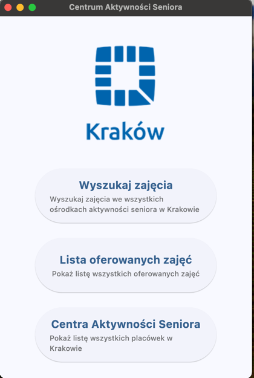

# Search for Senior Activities App

This project is a user-friendly application designed to help seniors (and their caregivers) easily find activities offered by Senior Activity Centers (Centra Aktywności Seniora – CAS) in Kraków.

📄 Traditionally, all CAS schedules were shared in individual PDF files across many subpages, making the search process difficult and time-consuming.

📲 This app streamlines the process by offering a clean interface and automatic data handling – no more manual browsing!

⸻

📌 Project Purpose

This app was created to improve access to information for older adults in Kraków.
It aims to:
* 	Eliminate the need to search through dozens of PDFs
* 	Provide a centralized, updated activity catalog
* 	Empower seniors with digital tools that are easy to use

⸻

🚀 Features
* 	🔍 Search Activities: Find activities by keywords (e.g., yoga, art, dancing, etc.).
* 	📊 Sort & Filter: Sort activities by time, day, center name, and more.
* 	📍 Location-Aware: Support for finding the nearest centers (geolocation-based search).
* 	📤 Email Extraction: Automatically scrapes CAS websites and extracts email addresses from PDF schedules.
* 	📁 Database Integration: Reads and displays data from an Excel database.
* 	👵 Senior-Friendly Interface: Built with accessibility and simplicity in mind using the Flet UI framework.

⸻

📂 Repository Structure


```plaintext
.
├── CAS_app.py                      # Main application with activity search, CAS lookup, and navigation
├── emails.py                       # Script for scraping email addresses from CAS websites (PDFs)
├── search_by_many_categories.py    # Advanced activity sorting/filtering functionality
├── search_by_many_parameters.py    # Additional multi-criteria search logic
├── CAS_data.xlsx                   # Main data file with CAS activity information
│   ├── Classes                     # Custom sheet with test data for the app
│   ├── CAS_OpenData                # Data imported from Kraków Open Data portal
│   └── CAS_emails                  # Emails scraped from PDF schedules
├── Cas.py                          # Helper module representing CAS (center) objects
├── Activity.py                     # Helper module representing Activity objects
├── assets/
│   └── logo.png                    # App image asset (required by Flet)
```

⸻

🛠 Technologies Used
* 	Python (3.11+ recommended)
* 	Flet – for building the desktop GUI
* 	pandas – powerful data manipulation and Excel handling
* 	openpyxl – reading/writing Excel .xlsx files
* 	geopy – calculating distances between user and CAS centers
* 	BeautifulSoup & requests – scraping CAS websites and PDF links
* 	pdfminer.six – extracting text (e.g. emails) from PDF activity schedules
* 	python-dateutil (relativedelta) – advanced date comparisons in filtering
* 	datetime – standard library for date/time handling

⸻

🧪 Sample Data

The Excel file CAS_data.xlsx contains:
* 	Classes – Our own curated data set for testing the app
* 	CAS_OpenData – Real data downloaded from the official Kraków Open Data portal
* 	CAS_emails – Automatically collected emails from CAS centers, via PDF scraping (emails.py)

⸻

---

🚀 Application (CAS_app.py)

🔍 Search by Activity Name (`/zajecia`)
- Search classes by typing part of the name (e.g., "yoga", "art").
- View dates, times, and CAS centers where the activity is available.
- Includes sorting and filtering by:
  - Activity type (e.g., sport, cultural, educational)
  - Delivery format (in-person / online)

📃 Browse All Activities with Descriptions (`/lista`)
- See a categorized list of all available activities.
- Click to view:
  - Full description (tailored to seniors)
  - List of CAS centers offering the activity

📍 Find Nearby CAS Centers (`/cas`)
- Enter your address to locate the nearest centers.
- Uses OpenStreetMap + geopy to calculate distances.
- Displays:
  - Center name and address
  - Distance from your location

🏠 Main Homepage
- Icon-based menu:
  - "Search Activities"
  - "Browse Activities"
  - "Find Centers Near You"
- Simple layout with large fonts and clear visuals

⸻

📬 Email Scraping (emails.py)

The emails.py script:
* 	Navigates through all CAS subpages on the official city portal
* 	Finds the most recent PDF attachment
* 	Extracts email addresses from the PDFs
* 	Saves the results to CAS_emails.xlsx


⸻

🏢 (Cas.py)
* 	Contains the CAS class representing a Senior Activity Center.
* 	Stores address, contact details, and a list of associated activities.
* 	Provides methods for searching and displaying CAS information.

⸻

🎯 (Activity.py)
* 	Defines the Activity class representing individual activities offered at CAS.
* 	Manages relation to a CAS instance.
* 	Stores category, schedule, price, description, and mode of the activity.

⸻

🔍 (search_by_many_parameters.py)
* 	Flet-based GUI app for interactive filtering of activities.
* 	Filters by category, date, time, price, and mode (online/offline).
* 	Displays search results as a list of selectable items.

⸻

📊 (search_engine_many_categories.py)
* 	Loads Senior Activity Center and activity data from Excel files.
* 	Implements filtering logic based on multiple criteria (category, price, date, time, mode).
* 	Populates CAS and Activity objects and returns matching activities.

⸻

📷 Screenshot (main page)



⸻


👥 Authors

Oleksandra Missa, Zbyszko Zgraja, Bartosz Bajorek